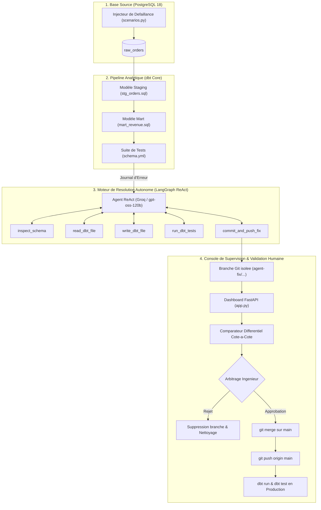

# Self-Healing-DataOps-Agent-for-dbt-Pipelines

## Architecture et Documentation Technique

Ce projet presente la conception, l'implementation et l'exploitation d'un agent autonome d'auto-reparation applique aux pipelines de donnees dbt (data build tool) et bases PostgreSQL. 

L'agent detecte et resout de maniere autonome les defaillances causees par les derives de schema amont (schema drift), valide ses modifications dans un environnement isole, et soumet ses correctifs a une passerelle de gouvernance humaine (Human-in-the-Loop) avant tout deploiement en production.

---

## 1. Contexte et Problematique

### 1.1 Le probleme de la derive de schema (Schema Drift)
Dans les architectures de donnees distribuees (Data Mesh, ELT moderne), les equipes de developpement applicatif amont font evoluer leurs schemas de base de donnees de facon asynchrone :
* Renommage d'attributs metier (exemple : `order_amount` renomme en `total_amount`).
* Renommage de dimensions temporelles (exemple : `user_dob` renomme en `date_of_birth`).
* Modification de types de donnees (exemple : conversion d'un `NUMERIC` en `TEXT` non formate).
* Refonte simultanee de plusieurs colonnes clefs.

Lorsque ces modifications arrivent dans la base de donnees brute (`raw_orders`), les modeles de transformation en aval (couches staging et marts dans dbt) echouent immediatement lors des executions planifiees.

### 1.2 Limites de la gestion manuelle
Le traitement traditionnel d'un incident de derive de schema suit un processus hautement repetitif mais consommateur de temps :
1. Declenchement d'une alerte pager/monitoring.
2. Diagnostic par un ingenieur data : lecture du journal d'erreur, connexion a la base source, execution d'un `information_schema` pour identifier le nouveau schema.
3. Modification du code SQL du modele de staging pour retablir la correspondance via un alias.
4. Execution locale de `dbt run` et `dbt test`.
5. Creation d'une branche Git, redaction d'un commit, soumission d'une Pull Request.
6. Validation par les pairs et merge sur la branche principale.

Cette routine mobilise des ressources d'ingenierie sur des operations a faible valeur ajoutee tout en prolongeant l'indisponibilite des donnees pour les consommateurs avals (analystes, dashboards metiers).

### 1.3 Objectifs de conception de l'agent
Le systeme repond a trois exigences fonctionnelles et architecturales fondamentales :
* **Autonomie d'investigation** : l'agent doit inspecter dynamiquement l'etat reel du catalogue PostgreSQL et comparer ce schema avec les attentes exprimees dans les modeles dbt existants.
* **Preservation du contrat d'interface** : la resolution ne doit jamais supprimer de colonne ni impacter les consommateurs avals. Elle doit adapter la couche d'entree (`staging`) au moyen d'alias ou de transtypages explicites, garantissant la continuite des modeles finaux (`marts`).
* **Gouvernance stricte et non-regression** : aucun agent ne doit pouvoir modifier la branche de production (`main`) de maniere unilaterale. L'isolation sur branche de travail, la reussite integrale des tests de contrainte (`dbt test`) et l'approbation formelle d'un operateur humain (Human-in-the-Loop) sont obligatoires.

---

## 2. Principes d'Ingenierie et Gouvernance

### 2.1 Principe du bac a sable (Sandboxing)
Toute tentative de resolution est executee dans un espace temporaire et isole :
* La base PostgreSQL est interrogee en lecture seule pour la phase d'introspection.
* Le code SQL corrige est applique localement sur une branche Git dediee au format `agent-fix/<modele>-<timestamp>`.
* Les tests unitaires dbt sont compiles et executes pour valider la coherence structurelle des vues et tables avant toute publication.

### 2.2 Règle d'inviolabilite de la production (Human-in-the-Loop)
L'intelligence artificielle n'a pas les droits d'ecriture directe sur la branche `main`. L'operateur humain dispose d'une interface de comparaison differentielle avant/apres. Tant que l'arbitrage humain n'est pas formalise, aucun code n'est fusionne ni pousse vers la production.

### 2.3 Idempotence et reproductibilite
Le systeme integre des routines d'initialisation (`init_db.py`, `scenarios.py`) permettant de reconstruire une base de reference propre, d'injecter des jeux de donnees deterministes et de repliquer les pannes a l'identique pour l'evaluation algorithmique.

---

## 3. Architecture Globale du Systeme



Le systeme se decompose en quatre sous-ensembles etanches :
1. **Couche de Persistance et Donnees Brutes** : PostgreSQL 18 hebergeant la table d'ingestion `raw_orders` et le catalogue de donnees.
2. **Couche de Transformation et Contrats de Donnees** : dbt Core organisant les dependances DAG entre `raw_orders`, `stg_orders` (vue) et `mart_revenue` (table agregee), encadrees par des contraintes d'unicite et de non-nullite.
3. **Moteur Cognitif LangGraph ReAct** : un graphe d'etat cyclique Reason-Act interagissant avec le runtime via un outillage specialise.
4. **Passerelle de Supervision et GitOps** : serveur FastAPI servant une interface web en temps reel via Server-Sent Events (SSE), fournissant une vue comparative differentielle et pilotant les commandes Git distantes.

---

## 4. Conception Detaillee de l'Agent IA (LangGraph ReAct)

### 4.1 Pourquoi LangGraph et le motif ReAct ?
Une approche d'appel LLM monolithique (prompt-to-code direct) echoue regulierement sur les pipelines de donnees pour plusieurs raisons :
* Absence de boucle de retroaction : le LLM ne peut pas verifier si sa correction SQL compile reellement dans le dialecte PostgreSQL.
* Hallucination de schema : le LLM a tendance a inventer des noms de colonnes plausibles plutot que d'observer la realite du catalogue de la base.
* Incapacite a gerer les erreurs secondaires : si la requete compile mais echoue a un test de contrainte metier, un appel simple ne sait pas iterer.

L'architecture s'appuie sur le motif **ReAct (Reasoning + Acting)** implemente via **LangGraph**. A chaque etape, l'agent produit :
1. Une trace explicite de **Pensee** (Reasoning) explicitant son hypothese de travail.
2. Une **Action** materialisee par l'appel d'un outil formel avec parametres JSON valides.
3. Une lecture de l'**Observation** produite par le retour de l'outil dans l'environnement systeme.

### 4.2 Graphe d'Etats et Cycle d'Execution

```text
       [Entree de l'Incident: Log d'erreur dbt]
                         |
                         v
                +-----------------+
                |   Noeud Agent   |<---------------------+
                | (LLM Reasoning) |                      |
                +-----------------+                      |
                         |                               |
              [Decision: Outil Requis ?]                 |
                   /            \                        |
             (OUI)/              \(NON - Fin)            |
                 v                v                      |
        +-----------------+   [Sortie: Rapport Final]    |
        |   Noeud Tools   |                              |
        |  (System Call)  |------------------------------+
        +-----------------+     (Retour Observation)
```

L'execution respecte un ordre logique determine :
1. **Inspection du journal de crash** : identification du modele impacte (`stg_orders`) et de l'erreur PostgreSQL (`column "user_dob" does not exist`).
2. **Consultation du modele cible** : execution de `read_dbt_file("stg_orders")` pour analyser la requete actuelle.
3. **Inspection du catalogue reel** : execution de `inspect_schema("raw_orders")` pour recuperer la liste exacte des colonnes presentes et leurs types dans PostgreSQL (`information_schema.columns`).
4. **Calcul de l'alignement semantique** : l'agent deduite par analyse contextuelle la correspondance entre l'ancien champ attendu et le nouveau champ present (ex: `date_of_birth` correspond a `user_dob`).
5. **Reecriture du modele** : generation de la requete SQL corrigee avec preservation du nom de sortie cible (`date_of_birth AS user_dob`) via `write_dbt_file`.
6. **Verification empirique** : execution de `run_dbt_tests`. Cet outil materialise les vues dans PostgreSQL puis execute la suite de tests dbt.
7. **Validation ou Re-iteration** :
   * Si les tests echouent : l'erreur est renvoyee a l'agent qui reformule sa correction.
   * Si les tests reussissent : l'agent execute `commit_and_push_fix` pour archiver le correctif sur une branche isolee.

### 4.3 Specification Formelle du Toolkit de l'Agent

L'agent dispose de cinq outils strictement delimites definis dans `src/agent_tools.py` :

#### `inspect_schema(table_name: str) -> str`
* **Entree** : nom de la table brute PostgreSQL (ex: `"raw_orders"`).
* **Traitement** : execution d'une requete SQL sur le dictionnaire de donnees :
  ```sql
  SELECT column_name, data_type 
  FROM information_schema.columns 
  WHERE table_name = 'raw_orders';
  ```
* **Sortie** : liste structuree des noms de colonnes et types reels.

#### `read_dbt_file(model_name: str) -> str`
* **Entree** : nom du modele dbt sans extension (ex: `"stg_orders"`).
* **Traitement** : recherche du fichier dans `dbt_project/models/staging/` ou `dbt_project/models/marts/` et lecture brute.
* **Sortie** : texte integral de la requete SQL du modele.

#### `write_dbt_file(model_name: str, new_sql: str) -> str`
* **Entree** : nom du modele dbt et nouveau corps SQL complet.
* **Traitement** : ecriture physique securisee du fichier SQL sur le disque.
* **Sortie** : message de confirmation avec chemin d'ecriture.

#### `run_dbt_tests() -> str`
* **Traitement** :
  1. Execution de `dbt run --profiles-dir .` pour compiler et re-materialiser la vue ou table dans PostgreSQL.
  2. Execution de `dbt test --profiles-dir .` pour verifier les contraintes declaratives (`not_null`, `unique`, intégrité relationnelle).
* **Sortie** : journal d'execution dbt comprenant le code de retour et le detail des tests (`PASS=2`, `WARN=0`, `ERROR=0`).

#### `commit_and_push_fix(model_name: str, fix_description: str) -> str`
* **Entree** : nom du modele corrige et description metier du correctif.
* **Traitement** :
  1. Creation et bascule sur une branche unique : `agent-fix/<model_name>-<timestamp>`.
  2. Indexation du fichier modifie (`git add`).
  3. Redaction du commit formel (`git commit -m "<fix_description>"`).
  4. Publication de la branche vers le remote GitHub configure (`git push -u origin <branch>`).
* **Sortie** : identifiant de branche et confirmation de publication.

---

## 5. Taxonomie des Derives et Strategies de Remédiation

Le repertoire comprend quatre scenarios de sabotage reproductibles (`scenarios.py`) modelisant les derives frequentes en entreprise :

| Identifiant Scenario | Niveau | Mutation Source PostgreSQL | Erreur Produite | Strategie de Remediation Autonome |
| :--- | :--- | :--- | :--- | :--- |
| `rename_amount` | Facile | `order_amount` -> `total_amount` | `column "order_amount" does not exist` | Application d'un alias preservant l'interface : `total_amount AS order_amount`. |
| `rename_dob` | Facile | `user_dob` -> `date_of_birth` | `column "user_dob" does not exist` | Mapping explicite de la dimension temporelle : `date_of_birth AS user_dob`. |
| `double_rename` | Intermediaire | `user_dob` -> `birth_date`<br>`user_id` -> `customer_id` | Echecs en chaine sur les modeles staging et marts | Deduction conjointe des deux attributs avec double alias : `birth_date AS user_dob`, `customer_id AS user_id`. |
| `type_change` | Avance | `order_amount` : `NUMERIC` -> `TEXT` | Incompatibilite sur les aggregations downstream (`sum(order_amount)`) | Transtypage explicite dans le staging : `order_amount::numeric AS order_amount`. |

Dans tous les cas, l'agent applique la regle de non-propagation : la correction est cantonnee au modele d'entree `stg_orders.sql`. Les modeles analytiques avals (`mart_revenue.sql`) et les tests de contraintes continuent ainsi de fonctionner sans modification.

---

## 6. Mecanique de Sandboxing et Compilation dbt

Un piege classique dans l'automatisation de dbt sous environnement Windows ou conteneurise reside dans la dissociation entre le code SQL et la base de donnees physique :
* Dans dbt, `dbt test` ne compile pas les requetes contre des donnees virtuelles : il execute des requetes SQL directement sur les relations existantes dans PostgreSQL.
* Si l'agent modifie `stg_orders.sql` et appelle directement `dbt test`, le test echouera systematiquement avec l'erreur :
  ```text
  relation "public.stg_orders" does not exist
  ```
* L'outil `run_dbt_tests()` execute donc obligatoirement un cycle en deux temps :
  1. `dbt run` : creation physique de la vue SQL dans le schema `public` de PostgreSQL avec la syntaxe corrigee.
  2. `dbt test` : interrogation des contraintes d'unicite et de non-nullite sur les donnees reelles.

De plus, l'environnement assure l'isolation du chemin d'execution sous Windows en localisant dynamiquement l'executable Python et le binaire dbt situe dans le virtualenv (`.venv/Scripts/dbt.exe`), eliminant les conflits de variables globales d'environnement.

---

## 7. Workflow GitOps et Validation Human-in-the-Loop

L'integration GitOps garantit l'alignement de l'infrastructure logicielle avec l'etat du referentiel de donnees :

```text
[Incident Detecte] 
       |
       v
[Branche: main (bloquee)]
       |
       v  (Creation automatique)
[Branche Sandbox: agent-fix/stg_orders-xxxx]
       |
       +--> Poussee sur GitHub (origin/agent-fix/xxxx)
       |
       v
[Portail Web: Comparateur Cote-a-Cote Avant / Apres]
       |
  +----+----+
  |         |
[Rejet]   [Approbation]
  |         |
  |         v
  |    1. git checkout main
  |    2. git merge agent-fix/xxxx
  |    3. git push origin main
  |    4. dbt run & test (Production)
  |         |
  v         v
[Cloture] [Deploiement Verifie & Trace sur GitHub]
```

### 7.1 Visualisation Differentielle Cote-a-Cote
La console web remplace le patch Git textuel par un comparateur graphique bidirectionnel :
* **Colonne Gauche (Version Rompue)** : requete originale issue de la branche `main` avec mise en surbrillance rouge de l'attribut manquant.
* **Colonne Droite (Version Corrigee)** : requete generee par l'agent sur la branche `agent-fix` avec mise en surbrillance verte de l'alias ou du transtypage introduit.
* **Traceabilite de l'arbitrage** : indication explicite de l'etat d'approbation et lien direct vers l'interface de comparaison de Pull Request sur GitHub.

### 7.2 Protocole d'approbation et promotion
Lors du clic sur « Approuver, Fusionner et Pousser sur GitHub » :
1. Le backend FastAPI prend le verrou local Git et bascule sur `main`.
2. Il execute un merge avance avec message structure tracant la validation humaine.
3. Il execute `git push origin main` pour synchroniser le referentiel GitHub distant.
4. Il re-materialise la production locale via `dbt run` et `dbt test`.
5. Il retourne l'empreinte SHA-1 du commit ainsi que l'URL GitHub permanente pour audit.

---

## 8. Arborescence du Projet

```text
Self-Healing-DataOps-Agent-for-dbt-Pipelines/
├── app.py                     # Serveur FastAPI : API REST, endpoints SSE et controle GitOps
├── demo.py                    # Script autonome d'execution CLI de demonstration
├── init_db.py                 # Initialisation deterministe de PostgreSQL et rechargement
├── scenarios.py               # Moteur de sabotage : 4 scenarios de derive de schema
├── requirements.txt           # Dependances Python figees (dbt-postgres, langgraph, fastapi)
├── .env.example               # Gabarit de configuration des variables d'environnement
├── README.md                  # Documentation technique du systeme
│
├── src/
│   ├── agent.py               # Definition du LLM Groq et du graphe LangGraph ReAct
│   ├── agent_tools.py         # Implementation des 5 outils systemes de l'agent
│   └── data_generator.py      # Generateur de donnees synthetiques d'achats
│
├── dbt_project/               # Entrepot de transformation dbt
│   ├── dbt_project.yml        # Configuration du projet dbt
│   ├── profiles.yml           # Configuration de connexion a PostgreSQL (target: dev)
│   ├── models/
│   │   ├── staging/
│   │   │   ├── stg_orders.sql # Modele d'entree nettoye et adapte par l'agent
│   │   │   └── schema.yml     # Contrats de colonnes et tests d'integrite (unique, not_null)
│   │   └── marts/
│   │       └── mart_revenue.sql # Modele analytique de synthese downstream
│   └── tests/                 # Tests personnalises eventuels
│
└── static/                    # Interface de controle Human-in-the-Loop
    ├── index.html             # Structure du Dashboard avec comparateur differentiel
    ├── style.css              # Feuille de styles et disposition cote-a-cote
    └── app.js                 # Gestion du flux SSE, affichage differentiel et appels API
```

---

## 9. Guide d'Installation et d'Execution Locale

### 9.1 Prerequis
* Python 3.10 ou superieur (teste et valide sous Python 3.12).
* PostgreSQL 14 a 18 en cours d'execution locale sur le port 5432.
* Git installe et configure localement.
* Une cle API Groq valide (modele utilise : `openai/gpt-oss-120b`).

### 9.2 Configuration de l'environnement virtuel
```bash
# 1. Cloner le depot
git clone https://github.com/guissii/Self-Healing-DataOps-Agent-for-dbt-Pipelines.git
cd Self-Healing-DataOps-Agent-for-dbt-Pipelines

# 2. Creer et activer l'environnement virtuel
python -m venv .venv

# Sous Windows (PowerShell) :
.venv\Scripts\Activate.ps1

# Sous Linux / macOS :
source .venv/bin/activate

# 3. Installer les dependances
pip install -r requirements.txt
```

### 9.3 Configuration des secrets (`.env`)
Creer un fichier `.env` a la racine du projet contenant :
```env
# Cle API Groq
GROQ_API_KEY=gsk_votre_cle_groq_ici

# Parametres de connexion PostgreSQL
DB_HOST=localhost
DB_PORT=5432
DB_NAME=my_db
DB_USER=admin
DB_PASSWORD=password123
```

### 9.4 Lancement du Serveur de Controle
```bash
python app.py
```
Le serveur demarre sur : **http://127.0.0.1:8000**

---

## 10. Deroulement Pas-a-Pas d'une Demonstration

1. **Initialisation de reference** :
   * Ouvrir l'URL `http://127.0.0.1:8000` dans un navigateur.
   * Cliquer sur **« Reset Baseline »**. Le systeme initialise les tables PostgreSQL, charge 5 commandes factices, compile dbt et valide les tests au vert (`dbt_ok: True`).
2. **Declenchement de l'anomalie** :
   * Selectionner l'un des scenarios dans le panneau de gauche (exemple : *Renommage simple : user_dob -> date_of_birth*).
   * Cliquer sur **« Declencher la Panne »**. Le journal d'erreur dbt s'affiche en rouge attestant du crash de compilation.
3. **Execution du cycle de reparation** :
   * Cliquer sur **« Reveiller l'Agent IA Auto-Guerisseur »**.
   * Suivre dans le terminal central les etapes de reflexion de l'agent, ses appels a `inspect_schema`, l'ecriture du nouveau SQL et la validation `dbt test` (100% PASS).
4. **Validation differentielle (HITL)** :
   * Examiner la boite de contexte decrivant la derive amont.
   * Consulter la vue **« Comparaison Cote-a-Cote »** pour verifier l'exactitude de l'alias produit.
   * Cliquer sur **« Ouvrir la Pull Request sur GitHub »** pour inspecter la branche isolee sur le depot distant.
5. **Approbation et mise en production** :
   * Cliquer sur **« Approuver, Fusionner et Pousser sur GitHub »**.
   * Le backend fusionne la branche sur `main`, pousse le commit sur GitHub, re-execute le pipeline en production et affiche le journal des 5 etapes validees avec le lien du commit.

---

## 11. Gestion des Cas Limites et Robustesse

* **Non-interference des processus de test** : les tests executes par l'agent sont isoles des tables analytiques principales jusqu'a l'accord formel.
* **Gestion des encodages Windows** : l'integralite des sorties de flux et de sous-processus reconfigure explicitement l'encodage en UTF-8 pour eviter les erreurs d'encodage `cp1252` sur consoles Windows.
* **Protection contre l'oubli de commit** : si le LLM omet d'appeler explicitement l'outil de commit a l'issue des tests dbt positifs, le gestionnaire de flux d'execution verifie la branche courante, cree automatiquement la branche d'isolation `agent-fix/...` et preserve l'integrite de `main`.
* **Securite des identifiants** : le fichier `.env` est exclu du suivi Git via `.gitignore`, protegeant les identifiants de base de donnees et les cles d'API.

---

## 12. Conclusion et Perspectives

Le projet demontre la viabilite technique d'un agent de maintenance autonome pour pipelines de donnees sous gouvernance humaine stricte. En combinant un graphe de raisonnement iteratif (LangGraph), une suite de validation declarative (dbt tests) et une promotion GitOps controlee, le systeme reduit le delai moyen de resolution d'incidents de schema de plusieurs heures a moins de 30 secondes, sans compromettre la securite ni la qualite de l'entrepot analytique.
