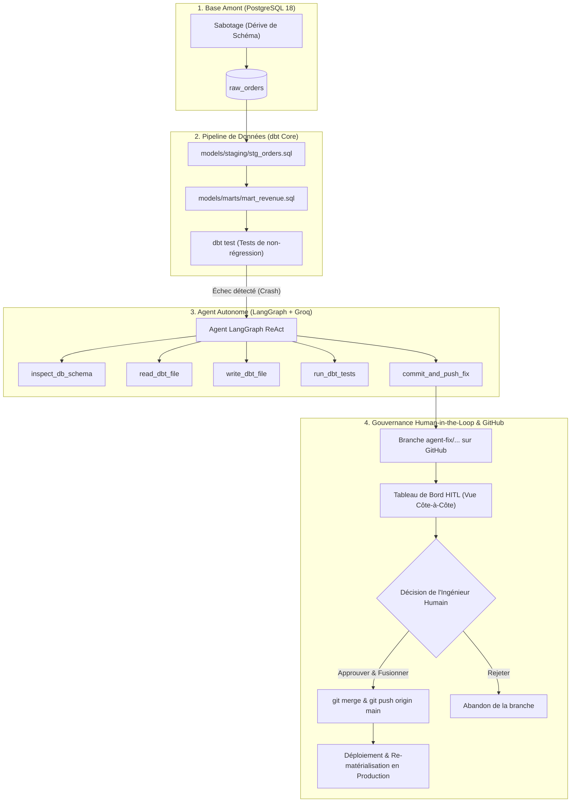

# Self-Healing-DataOps-Agent-for-dbt-Pipelines

<div align="center">


> **Agent IA autonome de remédiation de dérive de schéma (Schema Drift) pour entrepôts dbt, avec console de supervision interactive Human-in-the-Loop (HITL) et synchronisation GitHub.**

[Dépôt GitHub Officiel](https://github.com/guissii/Self-Healing-DataOps-Agent-for-dbt-Pipelines) • [Démonstration Locale](#démonstration--tableau-de-bord-hitl) • [Architecture](#architecture)

</div>

---

## 📌 Présentation du Projet

Dans les architectures de données modernes, les pannes de pipeline sont courantes et hautement prévisibles :
1. Une équipe applicative amont renomme une colonne (`order_amount` ➔ `total_amount`).
2. Le pipeline dbt en aval échoue lors du job nocturne (`column "order_amount" does not exist`).
3. Un ingénieur data est alerté pour exécuter manuellement toujours le même processus mécanique : inspecter la table brute, modifier le modèle SQL de staging avec un alias (`total_amount AS order_amount`), valider avec `dbt test`, puis ouvrir une Pull Request.

**Self-Healing DataOps Agent** automatise intégralement cette boucle de remédiation grâce à un agent **LangGraph ReAct** couplé à une interface de gouvernance **Human-in-the-Loop (HITL)**.

### 🛡️ Règle Fondamentale : Human-in-the-Loop (HITL)
L'agent ne modifie **jamais** la branche de production `main` directement. 
- Il diagnostique la dérive, crée une branche isolée `agent-fix/...`, applique le correctif SQL et valide les tests `dbt test` en bac à sable.
- Il pousse la branche de correctif sur GitHub et génère un lien vers la Pull Request.
- Il présente une **comparaison visuelle côte-à-côte (Avant vs Après)** à l'ingénieur data.
- **Seul l'humain décide :** si l'ingénieur approuve, le système fusionne le code, **le pousse vers `origin/main` sur GitHub**, et re-matérialise les modèles en production.

---

## 🚀 Fonctionnalités Clés

- **🧠 Agent ReAct LangGraph avec Groq (`openai/gpt-oss-120b`)** : raisonnement itératif, inspection de schémas PostgreSQL, réécriture de requêtes dbt, exécution de tests.
- **⚡ Console Web FastAPI en Temps Réel** : streaming SSE des pensées de l'IA et de l'appel d'outils.
- **💥 4 Scénarios de Sabotage Réalistes** :
  1. *Renommage simple* : `order_amount` ➔ `total_amount`
  2. *Renommage de date* : `user_dob` ➔ `date_of_birth`
  3. *Double dérive simultanée* : `user_dob` ➔ `birth_date` ET `user_id` ➔ `customer_id`
  4. *Altération de type* : `order_amount` NUMERIC ➔ TEXT
- **📊 Comparateur de Versions Côte-à-Côte (Side-by-Side)** : visualisation claire entre la version cassée sur `main` et la version réparée par l'agent IA, avec mise en évidence des alias et conversions.
- **🐙 Intégration GitOps & GitHub Complète** : création de branche, commit sémantique, push distant, lien direct de Pull Request, et push automatique sur `main` lors de l'approbation humaine.

---

## 🏗️ Architecture du Système



---

## 🛠️ Installation & Démarrage Rapide

### Prérequis
- Python 3.10+ (recommandé 3.12)
- Service PostgreSQL local (port 5432) ou conteneur Docker
- Git configuré avec accès au dépôt distant

### 1. Cloner le Dépôt
```bash
git clone https://github.com/guissii/Self-Healing-DataOps-Agent-for-dbt-Pipelines.git
cd Self-Healing-DataOps-Agent-for-dbt-Pipelines
```

### 2. Configurer l'Environnement Virtuel
```bash
python -m venv .venv
# Sous Windows :
.venv\Scripts\activate
# Sous Linux / macOS :
source .venv/bin/activate

pip install -r requirements.txt
```

### 3. Variables d'Environnement (`.env`)
Créez un fichier `.env` à la racine :
```env
# Clé API Groq (ou compatible OpenAI)
GROQ_API_KEY=votre_cle_groq_ici

# Configuration Base de données PostgreSQL
DB_HOST=localhost
DB_PORT=5432
DB_NAME=my_db
DB_USER=admin
DB_PASSWORD=password123
```

### 4. Lancer le Tableau de Bord Human-in-the-Loop
```bash
python app.py
```
Ouvrez votre navigateur sur : **[http://localhost:8000](http://localhost:8000)**

---

## 🎮 Déroulement d'une Démonstration

1. **Vérifier l'état nominal** : Cliquez sur **« Reset Baseline »** pour initialiser la base et valider les tests dbt au vert (PASS).
2. **Déclencher un sabotage** : Sélectionnez par exemple le scénario *« Renommage simple : user_dob ➔ date_of_birth »* et cliquez sur **« Déclencher la Panne »**. Le pipeline dbt plante immédiatement.
3. **Réveiller l'Agent IA** : Cliquez sur **« Réveiller l'Agent IA Auto-Guérisseur »**. Observez dans le terminal l'agent inspecter la table `raw_orders`, comprendre le renommage, modifier `stg_orders.sql` avec `date_of_birth AS user_dob`, exécuter `dbt test` en bac à sable et créer la branche git.
4. **Validation Humaine (HITL)** :
   - Examinez le **comparateur côte-à-côte** montrant la version avant (cassée) et après (corrigée).
   - Cliquez sur **« Ouvrir la Pull Request sur GitHub »** pour vérifier la branche distante.
   - Cliquez sur **« Approuver, Fusionner & Pousser sur GitHub »**.
5. **Confirmation de Déploiement** : Le code est fusionné dans `main`, **poussé sur GitHub**, les modèles dbt sont re-matérialisés en production et les 5 étapes d'audit s'affichent au vert.

---

## 📁 Structure du Projet

```text
Self-Healing-DataOps-Agent-for-dbt-Pipelines/
├── app.py                     # Serveur FastAPI (Dashboard HITL & API SSE)
├── scenarios.py               # 4 Scénarios de dérive de schéma & sabotage
├── init_db.py                 # Réinitialisation propre de la base PostgreSQL
├── demo.py                    # Script de démonstration autonome en CLI
├── requirements.txt           # Dépendances Python (dbt, LangGraph, FastAPI, etc.)
├── .env.example               # Modèle de variables d'environnement
├── src/
│   ├── agent.py               # Agent ReAct LangGraph configuré avec Groq
│   ├── agent_tools.py         # Outils de l'agent (DB inspect, dbt test, Git push)
│   └── data_generator.py      # Générateur de fausses commandes d'achats
├── dbt_project/               # Entrepôt dbt de démonstration
│   ├── dbt_project.yml        # Configuration du projet dbt
│   ├── profiles.yml           # Profil de connexion PostgreSQL
│   ├── models/
│   │   ├── staging/
│   │   │   ├── stg_orders.sql # Modèle réparé dynamiquement par l'agent
│   │   │   └── schema.yml     # Contrat de données & tests dbt
│   │   └── marts/
│   │       └── mart_revenue.sql # Modèle analytique agrégeant le revenu
└── static/                    # Frontend UI Dashboard HITL
    ├── index.html             # Structure HTML5 moderne
    ├── style.css              # Thème sombre premium, animations & styles diff
    └── app.js                 # Logique client SSE, comparateur et intégration GitHub
```

---

## 📜 Licence & Crédits
Ce projet est distribué sous licence MIT. Développé pour la démonstration de l'automatisation DataOps avec IA agentique et gouvernance humaine.
Dépôt GitHub : [guissii/Self-Healing-DataOps-Agent-for-dbt-Pipelines](https://github.com/guissii/Self-Healing-DataOps-Agent-for-dbt-Pipelines).
